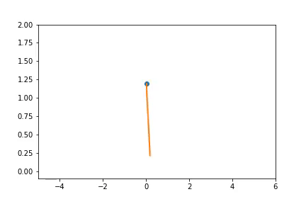

### Slip hopper with and without raibert control

|Without raibert control | With Raibert control|
|:----------------------:|:----------------------:|
|| |

### Passive Dynamic Walker
|                        |                        |
|:----------------------:|:----------------------:|
|||

### 3D Dynamic Biped 
|                                       |
|:-------------------------------------:|
||

#### This repo contains implementation of various assignments in python from [Legged Robotics](https://pab47.github.io/legs.html) course by Pranav Bhounsule.
